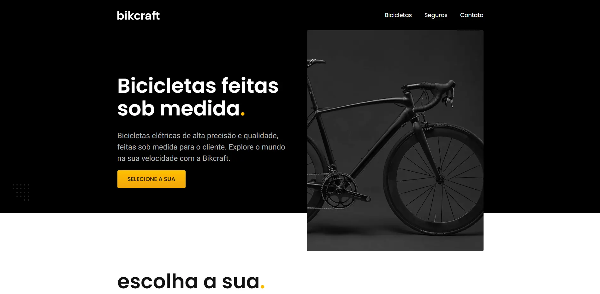

<h1 align="center"> Bikcraft </h1>

Bikcraft é um projeto desenvolvido durante o curso da Origamid.  

  <a href="#-tecnologias">Tecnologias</a>&nbsp;&nbsp;&nbsp;|&nbsp;&nbsp;&nbsp;
  <a href="#-projeto">Projeto</a>&nbsp;&nbsp;&nbsp;
  
 

  

## 🚀 Tecnologias

Esse projeto foi desenvolvido com as seguintes tecnologias:

- HTML e CSS
- JavaScript
- Git e Github
- Figma

## 💻 Projeto

Desenvolvido para colocar em prática o aprendizado adquirido durante o curso.

- [Acesse o projeto finalizado](https://gabtech1.github.io/Bikcraft-Origamid/)

---

Feito através dos estudos na Origamid :wave: